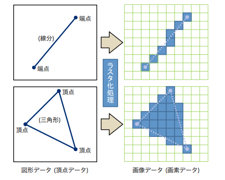
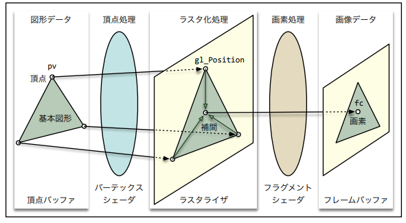
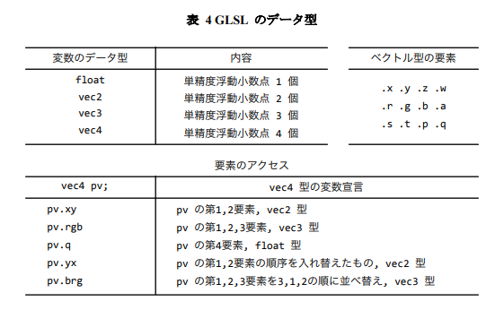

# プログラマブルシェーダ

OpenGLにおいて描画する図形のデータは、`線分の端点や多角形の頂点の、位置や色`などの情報です。  
この情報をもとに図形の画面上での位置や色を決定し、そこに図形を描きます。  
 

図形は画素で構成された画像データとして画面上に描かれます。  
それには、`頂点の情報から画素の情報への変換処理`が必要になります。  
この処理を`ラスタ化処理`、あるいは`ラスタライズ`といい、そのためのハードウェアを`ラスタライザ`といいます。  
グラフィックスハードウェアによる図形の描画は、このラスタ化処理をはさんで以下の３つの手順によって行われます。  

なお、このように処理を複数の段階にわけて、各ステージがデータを順送りにする処理の形態のことを`パイプライン処理`  
といいます。また、この図形描画のためのパイプライン処理を`レンダリングパイプライン` といいます。

1. 頂点の画面上での位置を決定する(頂点処理)
2. 頂点の位置と図形の種類をもとに画素の情報を生成する(ラスタ化処理)  
3. 画素の色を決定して画像を生成する(画素処理)


この頂点処理や画素処理は、かつては決まった処理を実行するハードウェアによって行われていました。  
これは`固定機能シェーダ`と呼ばれます。そしてグラフィックス表示の品質に対する要求が多様化するにつれ、  
このハードウェアも多機能化し、実数計算機能を搭載するなど、CPUに匹敵する複雑さを持つようになりました。  
このようなグラフィックスハードウェアは`GPU`と呼ばれるようになりました。  

しかし、このグラフィックス表示の品質に対する要求には再現がなく、ひとつひとつに対して  
ハードウェアに機能を追加して対応しようとしても限界があります。  
そこで、この頂点処理と画素処理のハードウェアをプログラム可能にして、機能をプログラムにより実装できるようにすることが考えられました。  
これを`プログラマブルシェーダ`といいます。そして、このプログラミングに用いるプログラミング言語を`シェーディング言語`といいます。  
OpenGLで扱えるシーディング言語は`GLSL`

プログラマブルシェーダは、いくつかのシェーダを組み合わせて構成されています。  
OpenGLの場合、頂点処理を担当するものを`バーテックスシェーダ`といい、  
画素処理を担当するものを`フラグメントシェーダ`といいます。

---

## シェーダプログラム

GLSLのシェーダプログラムを利用する手順は次のようになります

1. `glCreateProgram()`関数によってプログラムオブジェクトを作成します
2. `glCreateShader()`関数によって、バーテックスシェーダとフラグメントシェーダのシェーダオブジェクトを作成します。
3. `glShaderSource()`関数によって、作成したそれぞれのシェーダオブジェクトに対してソースプログラムを読み込みます。
4. `glCompileShader()`関数によって読み込んだソースプログラムをコンパイルします。  
5. `glAttachShader()`関数によってプログラムオブジェクトにシェーダオブジェクトを組み込みます。
6. `glLinkProgram()`関数によってプログラムオブジェクトをリンクします。

以上の処理によりシェーダのプログラムオブジェクトが作成されますから、  
図形を描画する前に`glUseProgram()`関数を実行して、図形の描画にこのシェーダプログラムを使うようにします。

---

## シェーダのソースプログラム GLSL

**バーテックスシェーダのソースプログラム point.vert** 

描画する図形の頂点の位置をそのままレンダリングパイプラインの次のステージに送るなら、  
バーテックスシェーダのソースプログラムは次のようになります。  
このプログラムは入力された図形データのひとつひとつの頂点に対して実行されます。
```
#version 150 core
in vec4 position;
void main()
{
    gl_position = position;
}
```
この１行目の`#version`の行は使用するGLSLのバージョンを指定します。  
`150`はOpenGL3.2以降で使用できるGLSL1.5を使用することを表し、  
`core`はOpenGL3.0より前のバージョンの機能をサポートしない`Core Profile`を用いることを表します。

２行目は。レンダリングパイプラインの前のステージからこのシェーダプログラムに送られたデータを受け取る  
`in 変数`を`position`という変数名で宣言しています。  
バーテックスシェーダの`in 変数`には、CPUから送られた図形データの一つの頂点のデータが格納されます。  
この頂点データを`頂点属体(attribute)`といい、この`in 変数`を特に`attribute変数`と言います。

`vec4`はこの変数のデータ型が32bit浮動小数点型(float型)の４要素のデータからなるベクトル型であることを示します。  
ベクトル型には、このほかに２要素の`vec2`や３要素の`vec3`がある。  


シェーダプログラムはC++言語同様`main()`関数から実行を開始します。  
ただし、シェーダプログラムのmain()科s縫うは引数を持たず値を返すこともないので  
必然的に定義は`void main()`になります。  

頂点属性は`CPU`から一旦`GPU`が管理する`頂点バッファオブジェクト`と呼ばれるメモリに格納します。  
その後`CPU`から`描画命令(ドローコール)`を送ると、`GPU`は頂点バッファオブジェクトから頂点ごとに  
頂点属性を取り出して`attribute変数`に格納し、バーテックスシェーダの処理を実行します。

`gl_Position`は`GLSL`の組み込み変数で、この変数に代入した値がパイプラインの次のステージに送られます。  
`バーテックスシェーダは必ずこの変数に値を代入しなければなりません。`  
このプログラムでは`attribute変数`positionをそのまま`gl_Position`に代入しているので、図形の描画に指定された頂点属性をそのまま次のステージ(ここではラスタライザ)に送ります。

---

**フラグメントシェーダのソースプログラム point.frag**

ラスタライザは描画する図形の各画素について、フラグメントシェーダの処理を実行します。  
画素に赤色を設定するなら、フラグメントシェーダのソースプログラムは次のようになります。
```
#version 150 core
out vec4 fragment;
void main()
{
    fragment = vec4(1.0,0.0,0.0,1.0);
}
```

この２行目は、フラグメントの色の出力先の`out 変数`を`fragment`という変数名で宣言しています。  
`out変数`に代入したデータは、レンダリングパイプラインの次のステージに送られます。  
フラグメントシェーダの`out変数`に代入した値は、`フレームバッファのカラーバッファ`に格納されます。

---

## シェーダオブジェクトの作成

- GLuint glCreateShader(GLenum shaderType)  
シェーダオブジェクトを作成します。戻り値は作成されたシェーダオブジェクト名(番号)で、  
作成できれば0でない正の整数、作成できなければ0を返します。  
    - shaderType  
        作成するシェーダの種類を指定します。  
        バーテックスシェーダを作成する場合は`GL_VERTEX_SHADER`  
        フラグメントシェーダを作成する場合は`GL_FRAGMENT_SHADER`  

- void glShaderSource(GLuint shader,GLsizei count,const GLchar **string,const GLint *length)  
    - shader  
    glCreateShader()関数の戻り値として得たシェーダオブジェクト名(番号)  
    - count  
    引数 string に指定した配列の要素数  
    - count  
    引数`string`に指定した配列の要素数
    - string  
    シェーダのソースプログラムの文字列の配列。シェーダーソースファイルを読み込んで得たデータを渡す。  
    - length  
    引数`length`が`NULL(0)`でなければ、lengthの各要素には`string`の対応する要素の文字列の長さ(文字数)を格納します。また、この`length`の要素に負の値を格納したときは、`string`の対応する要素の文字列の終端が  
    NULL文字(`\0`)になっている必要があります。

- void glCompileShader(GLuint shader)  
シェーダオブジェクトに読み込まれたソースファイルをコンパイルする。  
    - shader  
    コンパイルするシェーダオブジェクト名(番号)

シェーダのソースプログラムのコンパイルに成功したなら、それをプログラムオブジェクトに組み込みます。  
プログラムオブジェクトに組み込んだシェーダオブジェクトは、ほかに使うあてがなければ不要なので、ここで削除マークをつけておきます。  
```c++
// プログラムオブジェクトにシェーダオブジェクトを組み込む
glAttachShader(program, vobj);
// シェーダオブジェクトを破棄？
glDeleteShader(vobj);
```

- void glAttachShader(GLuint program, GLuint shader)  
    - prgram  
    シェーダオブジェクトを組み込むプログラムオブジェクト名(番号)  
    - shader  
    組み込むシェーダオブジェクト名(番号)

- void glDetachShader(GLuint program,GLuint shader )  
プログラムオブジェクトからシェーダオブジェクトを取り外します  
    - program  
    シェーダオブジェクトを取り外すプログラムオブジェクト名  (番号)。
    - shader  
    取り外すシェーダオブジェクト名 (番号)。

- void glDeleteShader(GLuint shader)  
シェーダーオブジェクトに削除マークをつけます  
    - shader  
        削除マークを付けるシェーダオブジェクト名 (番号)。


`glDeleteShader()`関数で削除マークを付けたシェーダオブジェクトは、そのシェーダオブジェクトがすべての  
プログラムオブジェクトから`glDetachShader()`関数によって取り外されたときに削除されます。  またプログラムオブジェクトが削除されるときには、それに組み込まれているシェーダオブジェクトは自動的に取り外されます。  
したがって、削除マークがつけられたシェーダオブジェクトは、それを組み込んだプログラムオブジェクトがすべて  
削除された時点で削除されます。  

なお、プログラムオブジェクト自体に削除マークをつけるには、`glDeleteProgram()`関数を用います。  
削除マークを付けたプログラムオブジェクトは、どのレンダリングコンテキストでも使用されなくなったときに削除されます。

---

## プログラムオブジェクトのリンク

プログラムオブジェクトに必要なシェーダオブジェクトを組み込んだら、プログラムオブジェクトのリンクを行います。  
その前に、図形の頂点の位置を受け取る`attribute変数`の場所と、`fragment変数`の出力先を指定しておきます。  
これはいずれも0以上の整数です。  
CPU側のプログラムとGPU側のシェーダプログラムの間のデータの受け渡しは、  
このような番号を開始て行います。これはGPUのハードウェアのレジスタ番号に相当します。  

```C++
glBindAttribLocation(program,0,"position");
glBindFragDataLocation(program,0,"fragment");
glLinkProgram(program);
```

- void glBindAttribLocation(GLuint program,GLuint index,const GLchar *name)  
バーテックスシェーダの`attribute 変数`の場所(番号)を指定します。  
`attribute変数`はバーテックスシェーダのソースプログラム内では`in変数`として宣言されます。  
    - program  
        `attribute変数`の場所を調べるプロジェクト名(番号)  
    - index  
    引数`name`に指定した`attribute変数`の場所を示す0以上の整数。デフォルトは0
    - name  
    バーテックスシェーダのソースプログラム中の`attribute変数`の変数名の文字列

- void glBindFragDataLocation(GLuint program, GLuint colorNumber, const char *name)  
    - program  
    フラグメントの出力変数 (out 変数) の場所を調べるプログラムオブジェクト名 (番号)。  
    - index  
    引数 name に指定した out 変数の場所 (番号) を、0 以上の整数で指定します。デフォルトでは 0 が設定されています。0 は標準のフレームバッファのカラーバッファを示します  
    - name  
    フラグメントシェーダのソースプログラム中の out 変数の変数名の文字列。

- void glLinkProgram(GLuint program)  
    `program`に指定したプログラムオブジェクトをリンクします。これが成功すれば、シェーダプログラムが完成します。  
    - program  
    リンクするプログラムオブジェクト名(番号)。

---

## プログラムオブジェクトを作成する手続き
```C++
// プログラムオブジェクトを作成する
// vsrc: バーテックスシェーダのソースプログラムの文字列
// fsrc: フラグメントシェーダのソースプログラムの文字列
GLuint createProgram(const char *vsrc, const char *fsrc)
{
 // 空のプログラムオブジェクトを作成する
 const GLuint program(glCreateProgram());
 if (vsrc != NULL)
 {
    // バーテックスシェーダのシェーダオブジェクトを作成する
    const GLuint vobj(glCreateShader(GL_VERTEX_SHADER));
    glShaderSource(vobj, 1, &vsrc, NULL);
    glCompileShader(vobj);
    // バーテックスシェーダのシェーダオブジェクトをプログラムオブジェクトに組み込む
    glAttachShader(program, vobj);
    glDeleteShader(vobj);
 }
if (fsrc != NULL)
 {
    // フラグメントシェーダのシェーダオブジェクトを作成する
    const GLuint fobj(glCreateShader(GL_FRAGMENT_SHADER));
    glShaderSource(fobj, 1, &fsrc, NULL);
    glCompileShader(fobj);
    // フラグメントシェーダのシェーダオブジェクトをプログラムオブジェクトに組み込む
    glAttachShader(program, fobj);
    glDeleteShader(fobj);
 }
 // プログラムオブジェクトをリンクする
 glBindAttribLocation(program, 0, "position");
 glBindFragDataLocation(program, 0, "fragment");
 glLinkProgram(program);
 // 作成したプログラムオブジェクトを返す
 return program;
}
```

---


