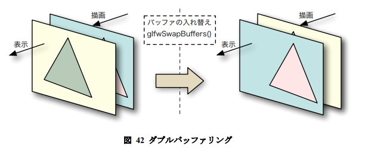

# OpenGLってなんだい

ハードウェアの持つ3次元コンピューターグラフィックス関連の演算機能をソフトウェアから呼び出すための  
規約を定めたインターフェイス(API)標準の1つ。  
オペレーティングシステムを特定しない、ソフトウェアインターフェイス。つまりOS(windowsとかmac)に関係なく使え(directxはwindowsだけ)、

コンピューターにGPUが搭載されている場合にはその機能を直接呼び出すことができるので、  
通常のソフトウェアのようにCPUだけで処理する場合に比べ格段に校則に処理することができる。  
GPU内部の動作を細かく記述することができる独自の言語(GLSL)を規定しており、開発者が独自のプログラマブルシェーダーを作成して対応GPUに転送することで様々な表現を行うことができる。

---

## GLFW

GLFWはOpenGLの`補助ライブラリ`で、
- ウィンドウ管理や入力デバイスの制御
- できる限りシンプルな機能構成
- ずっとメンテされてる

といった特徴がある。

## GLEW

GLEWはOpenGLの`補助ライブラリ`。
- OpenGLの拡張機能のプロシージャを取得
- 複雑な取得作業も単純化
- シェーダーとか殆どのモダンな機能は拡張機能なのでGLEWは必須

といった感じ。
ちなみにOpenGLの拡張機能取得はそれ自体が結構面倒なので、それを簡略化してくれるGLEWは  
マルチプラットフォームを視野に入れていなくても十分有用である。

---

## GLFWの初期化

`glfwInit()`でGLFWの初期化を行います。  
失敗するとnullptrが返ってくるよ。

---
## ウィンドウの初期化

`glfwCreateWindow(int width,int height,const char* title,GLFWmonitor* monitor,GLFWwindow* share)`  

GLFWのウィンドウを作成します。戻り値は作成したウィンドウのハンドル(`GLFWwindow*`)  
ウィンドウが開かなければnullを返す。

- width  
作成するウィンドウの横幅の画素数
- height  
作成するウィンドウの高さの画素数
- title  
作成するウィンドウのタイトルバーに表示する文字列。文字コードはUTF-8
- monitor  
ウィンドウをモニタの全面に表示(フルスクリーン)するとき、表示するモニタを指定する。  
フルスクリーンモードでなければNULLを指定する。

- share  
引数shareにほかのウィンドウハンドルを指定すれば、そのウィンドウとテクスチャなどのリソースを共有をする。  
nullを指定すれば、リソースの共有は行わない。

---

## 描画するウィンドウの指定

`void glfwMakeContextCurrent(GLFWwindow *const window)`  
引数 window に指定したハンドルのウィンドウのレンダリングコンテキストをカレント (処
理対象) にします。  
レンダリングコンテキストは描画に用いられる情報で、ウィンドウごとに保持されます。  
図形の描画はこれをカレントに設定したウィンドウに対して行われます。

---

## 背景色

`void glClearColor(GLfloat R, GLfloat G, GLfloat B, GLfloat A)`  
`glClear(GL_COLOR_BUFFER_BIT)` でウィンドウを塗り潰す色を指定します。(0.0～1.0)

---

## メインループ

ウィンドウが開いている間whileで描画ループさせます。ウィンドウが開いているかどうかは  
`glfwWindowShouldClose()`関数で調べることができます。  
このループの中では、最初に`glClear()`関数を使って画面(フレームバッファのカラーバッファ)を消去します。  
その後、そこにOpenGLにより図形の描画を行います。  
描画が終わったら`glfwSwapBuffer()`関数実行して、図形を描画したカラーバッファと現在図形を表示しているカラーバッファを入れ替えます。この処理は`ダブルバッファリング`といいます。  

最後に、このプログラムが何をすべきか判断するために、この時点で発生しているイベントを調査します。
`glfwWindowShouldClose()`によるウィンドウを閉じるべきかどうかの判断も、このイベント調査に基づいて行われます。  
イベントの調査には、マウスなどで操作する`対話アプリケーションソフトウェア`の場合は、  
イベントが発生するまで待つ`glfwWaitEvents()`関数を用います。  
これに対して、時間とともに画面の表示を更新するアニメーションなどの場合は、イベントの発生を待たない  
`glfwPollEvents()`関数を用います。
```C++
#include <iostream>
#include <GLFW/glfw3.h>
int main()
{
    // GLFW を初期化する
    if (glfwInit() == GL_FALSE)
    {
        // 初期化に失敗した
        std::cerr << "Can't initialize GLFW" << std::endl;
        return 1;
    }
    // ウィンドウを作成する
    GLFWwindow *const window(glfwCreateWindow(640, 480, "Hello!", NULL, NULL));
     if (window == NULL)
     {
         // ウィンドウが作成できなかった
        std::cerr << "Can't create GLFW window." << std::endl;
        glfwTerminate();
        return 1;
    }

    // 作成したウィンドウを OpenGL の処理対象にする
    glfwMakeContextCurrent(window);

    // 背景色を指定する
    glClearColor(1.0f, 1.0f, 1.0f, 0.0f);

    // ウィンドウが開いている間繰り返す
    while (glfwWindowShouldClose(window) == GL_FALSE)
    {
         // ウィンドウを消去する
        glClear(GL_COLOR_BUFFER_BIT);
        //
        // ここで描画処理を行う
        //
        // カラーバッファを入れ替える
        glfwSwapBuffers(window);
        // イベントを取り出す
        glfwWaitEvents();
 }
}
```

- int glfwWindowShouldClose(GLFWwindow *const window)  
windowに指定したウィンドウを閉じる必要があるとき、戻り値は非0になります。

- void glClear(GLbitfield mask)  
ウィンドウを塗りつぶします。`mask`には塗りつぶすバッファを指定します。  
フレームバッファは色を格納するカラーバッファのほか、隠面消去処理に使う`デプスバッファ`、  
図形の型抜きを行う`ステンシルバッファ`など複数のバッファで構成されており、  
これらが一つのウィンドウに重なっています。  
`mask`に`GL_COLOR_BUFFER_BIT`を指定したときは、カラーバッファだけど`glClearColor()`関数で指定した色に塗りつぶします。

- void glfwSwapBuffers(GLFWwindow *const window)  
windowに指定したウィンドウのカラーバッファを入れ替えます。  
図形を描画した後にこの関数を実行しなければ描画したものは画面に表示されません。

- void glfwWaitEvents(void)  
マウスの操作などのイベントの発生を待ちます。イベントが発生したら、それを記録してプログラムの実行を再開します。  
この関数はメインのループ以外で実行すべきではありません。  
待ち時間の最大値を引数に秒で指定できる`glfwWaitEventsTimeout(double sec)`もあります。  

- void glfwPollEvents(void)  
マウス操作などのイベントを取り出し、それを記録します。この関数はプログラムを停止させないので、  
アニメーションのように連続して画面表示を更新する場合に使用します。

---

## バッファについて

バッファは一般に緩衝器と訳され、一般に２つのものの一方からもう一方に何らかの影響を与える状況にあるとき、  
この２つの間に入って影響の仲立ちをするもののことをいいます。  
OpenGLにおけるバッファは、`データを次の処理に引き渡すために用いるメモリ`のことを指します。  
OpenGLではいろいろな種類のバッファを使用しますが、ここで説明しているバッファは、描画した図形を画面に表示するために用いるフレームバッファのカラーバッファです。

  

 図形は`フレームバッファのカラーバッファ`に描画されます。  
 このカラーバッファの内容が読みだされて画面に表示されます。ここでフレームバッファへの描画と読みだしを同時に  
 行うと、表示にちらつきが発生してしまいます。  
 `ダブルバッファリング`はカラーバッファを二つ用意しておいて、一方を表示している間にもう一方に描画する手法です。  
 この描画が完了し、かつ直前の画面表示が完了した時点(垂直同期タイミング、V-Sync)でこの二つのカラーバッファを入れ替えることでちらつきの発生を抑えます。

 

---

## イベントについて

対話的なアプリケーションソフトウェアでは、マウスなどの操作に対応した処理を随時実行する必要があります。  
このように`ある処理の実行のきっかけとなる出来事をイベント`といいます。  
発生したイベントに対応する処理の実行方法には、画面表示のたびに、`glfwWaitEvents()`関数や`glfwPollEvents()`関数を  
用いてイベントを取り出す方法(ボーリング方式)と、  
特定のイベントが発生した時に実行する関数をあらかじめ登録しておく方法(コールバック方式)があります。

---

## 終了処理

- void glfwTerminate(void)  
GLFW の終了処理を行います。glfwInit() 関数で GLFW の初期化に成功した場合は、  
プログラムを終了する前に、この関数を実行する必要があります。  
この関数は GLFW で作成した全てのウィンドウを閉じ、確保した全てのリソースを解放して、プログラムの状態を  
 glfwInit() 関数で初期化する前に戻します。この後に GLFW の機能を使用するには、  
 再度 glfwInit() 関数を実行しなければなりません。

 - int atexit(void (*function)(void))  
 atexit() 関数は、引数 function に指定した関数を、プログラム終了時に実行するよう登録します。

 ---

 ## GLEWの初期化

 glewはOSにサポートされていないOpenGLの機能を有効にし、プラットフォームによるソースプログラムの  
 違いを吸収するために導入する。

 - GLenum glewInit(void)  
 ハードウェアやドライバには用意されているにも関わらず、プラットフォームではサポートされていない  
 OpenGLの機能を有効にし、プログラムから呼び出せるようにする。

 ---

 ## OpenGLのバージョンとプロファイルの指定

 OpenGL3.2以降の機能を使用してプログラムを作成します。  
 そのため、OpenGLのバージョンやプロファイルを指定してウィンドウを作成します。  
 これは`glfwCreateWindow()`関数でウィンドウを作成する前に、`glfwWindowHint()`関数を用いて行います。

- void glfwWindowHint(int target, int hint)  
    - target  
    ヒントを設定する対象。以下のものが指定できます。  
        - `GLFW_RED_BITS, GLFW_GREEN_BITS, GLFW_BLUE_BITS, GLFW_ALPHA_BITS`  
        それぞれカラーバッファの赤色・緑色・青色・アルファに割り当てるビット数を hint に指定します。  
        デフォルトはいずれも 8 です。  
        - `GLFW_DEPTH_BITS`  
        デプスバッファに割り当てるビット数を hint に指定します。デフォルトは 24 です。  
        - `GLFW_STENCIL_BITS`  
        hint にマルチサンプル時のサンプル数を指定します。0 を指定するとマルチサンプルが無効になります。  
        デフォルトは 0 です。  
        - `GLFW_STEREO`  
        hint に GL_TRUE を指定すればステレオモードになります。デフォルトは GL_FALSE です。  
        これを GL_TRUE にできるかどうかは、ハードウェアに依存します。  
        - `GLFW_RESIZABLE`  
        hint に GL_TRUE を指定すればマウス等でウィンドウのサイズが変更できるようになります。デフォルトは GL_TRUE です。  
        GL_FALSE を設定していても、glfwSetWindowSize()関数によってプログラム中からウィンドウのサイズを変更することは可能です。  
        - `GLFW_CLIENT_API`  
        hint に GLFW_OPENGL_ES_API を指定すれば OpenGL ES の API を使用します。  
        デフォルトは GLFW_OPENGL_API です。  
        - `GLFW_CONTEXT_VERSION_MAJOR`  
        使用する OpenGL の最低バージョンのメジャーバージョン番号を hint に指定します。  
        バージョン 3.2 以降の機能しか使用しないなら 3 です。デフォルトは 1 です。  
        - `GLFW_CONTEXT_VERSION_MINOR`  
        使用する OpenGL の最低バージョンのマイナーバージョン番号を hint に指定します。  
        バージョンが 3.2 以降の機能しか使用しないなら 2 です。デフォルトは 0 です。  
        - `GLFW_OPENGL_FORWARD_COMPAT`  
        OpenGL のバージョン 3.0 以降において、Forward Compatible Profile (古い機能を削除した前方互換プロファイル) を使用する場合は、  
        hint に GL_TRUE を指定します。デフォルトは GL_FALSE です。  
        - `GLFW_OPENGL_PROFILE`  
        使用する OpenGL のプロファイルを指定します。hint には、OpenGL 3.0 より前の古い機能をすべて含む  
        Compatible Profile を使う場合は GLFW_OPENGL_COMPAT_PROFILE、  
        古い機能をサポートしない Core Profile を使う場合はGLFW_OPENGL_CORE_PROFILE を指定します。  
        デフォルトは GLFW_OPENGL_ANY_PROFILE で、この場合はシステムの設定に依存します。

---

## 作成したウィンドウに対する設定

作成したウィンドウに対する設定は、`glfwCreateWindow()`関数によるウィンドウの作成に成功した後に行います。  
ここでは`glfwSwapInterval()`関数によって`ダブルバッファリング`におけるバッファの入れ替えタイミングを設定します。  

- void glfwSwapInterval(int interval)  
ダブルバッファリングにおける、カラーバッファの入れ替えのタイミングを指定します。  
    - interval  
    カラーバッファを入れ替える際に待つディスプレイの垂直同期タイミング(V-Sync)の最小回数。  
    通常は１。０を指定するとディスプレイの垂直同期タイミングを待たなくなるため、数値の上ではフレームレートが上昇することがあるが、完全な画面表示が行われるわけではない。  
    