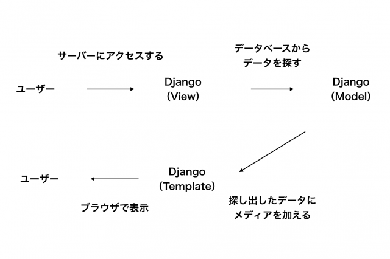

# Django

## 仮想環境

- なぜ仮装環境をつくる  
複数のシステムを開発する時に、`各システム専用の環境`を手軽に用意する。  
例えば、システムAでは`Django1.6`を、システムDjango1.8を使っているような場合  
仮装環境がなければ、どちらか一方のバージョンしかインストールすることができず。  
PC自体を分けて使うか、その都度違うバージョンのDjangoをインストールする必要ができてしまう。  

俺がシステムAをDjango1.6で開発した後にシステムBを1.8で作ろうと思った時に  
仮装環境作ってないと困るよって話。

---

## 仮装環境

作り方
1. ディレクトリを用意します
2. コマンドラインでそのディレクトリまで移動します
3. `python -m venv 仮装環境名`

用意したディレクトリに仮装環境名ディレクトリが作成されます。

操作  
`. 仮装環境名\Scripts\activate`  
を実行して、仮装環境を起動する。  
`deactivate`  
で終了。

---

## Djangoインストール

Djangoのインストールに使用する最新バージョンの`pip`をインストール
```
python -m pip install --upgrade pip
```

最初に requirements.txt ファイルを作り、以下のテキストを追加
```
Django~=2.0.6
```

そして、以下のコマンドを実行してDjangoをインストール
```
pip install -r requirements.txt
```

いじょ！！

Anacondaいれたせいで競合してpipが起動できなかったけど  
なんか直すexeファイル貰って直しました。

---

## Djangoプロジェクトの作成

新しいプロジェクト`mysite`を作成
```
django-admin startproject mysite .
```

- manage.py  
仮想環境ディレクトリ直下にある。サイトの管理に役立つスクリプト  
これを使用して、他のものをインストールすることなく、私たちのコンピューター上で  
Webサーバーを起動することができる。

- setting.py  
Djangoで作成したプロジェクト直下にある。  
ウェブサイトの設定が含まれている

- urls.py  
Djangoで作成したプロジェクト直下にある。  
urlressolverで使用されるパターンのリストが含まれる

## setting.pyの設定  

タイムゾーン
```python
# 自分の住んでいるところに設定
TIME_ZONE = 'Asia/Tokyo'
```

言語
```python
# 日本語
LANGUAGE_CODE = 'ja'
```

静的ファイルのパスとCSS
```python
STATIC_URL = '/static/'
STATIC_ROOT = os.path.join(BASE_DIR, 'static')
```

ホストネームの追加
```python
ALLOWED_HOSTS = ['127.0.0.1', '.pythonanywhere.com']
```


## データベースのセットアップ
```python
# Djangoデフォルトで使うデータベース　sqlita3
DATABASES = {
    'default': {
        'ENGINE': 'django.db.backends.sqlite3',
        'NAME': os.path.join(BASE_DIR, 'db.sqlite3'),
    }
}
```

データベースを作成するには、コンソールで次のコードを実行しよう
```
python manage.py migrate
```

---

## Webサーバーを起動する

```
python manage.py runserver
```

ウェブサイトが稼働していることを確認するには次のアドレスをいれればよい  
`http://127.0.0.1:8000/`

ウェブサーバー稼働中は、コマンドラインは新しいコマンドを実行しません。  
これはWebサーバーが動作している間はずっとリクエストを待つためです。  

Webサーバーの実行中に追加のコマンドを入力するには、新しいターミナルウィンドウを開き  
virtualenvをアクティブにします。  
Webサーバーを停止するには、実行中のウィンドウに戻り、  
`Ctrl + C キーを同時推しする`

---

## Djangoモデル

ブログを作るうえで、中のポストを格納するものが欲しい。そのために必要なものは`オブジェクト`  

ブログポストとは何か、どんなプロパティがあるのか  
ブログポストには`コンテンツ`と`タイトル`が必要ですね。それからそれを`書いた人`が分かるといいでしょう。 最後に、ポストを`いつ作成`、`公開`したかも分かるといいですね。　　
さらにブログポストは`公開`されている必要があるので、`publish`メソッドが必要。  

では、ブログポストのDjangoモデルを作りましょう。  
Djangoモデルは特別なオブジェクトで、`データベース`に格納されます。  
データベースはデータの集まりです。ここにユーザーやブログポストの情報を格納します。  
データを格納するのに`SQLiteデータベース`をつかみます。これはDjangoのデフォルトのデータベースです。  
データベースの中のモデルは、列(フィールド)と行(データ)があるスプレッドシートのようなもの。

---

## 新しいアプリケーションの作成

プロジェクトの中に別のアプリケーションを作ります。  
アプリケーションを作るために、次のコマンドをコンソールの中で走らせましょう。
```
python manage.py startapp blog
```
これで新しい`blog`ディレクトリが作られます。  

アプリケーションを作ったら、Djangoにそれを使うように伝えなければなりません。  
それは`mysite/settings.py`でします。エディタでこれを開き、`INSTALLED_APPS`を見つけ、'blog' という一行を追加します。
```python
INSTALLED_APPS = [
    'django.contrib.admin',
    'django.contrib.auth',
    'django.contrib.contenttypes',
    'django.contrib.sessions',
    'django.contrib.messages',
    'django.contrib.staticfiles',
    'blog',
]
```

---

## Djangoのモデルについて

Djangoで使われる`model`の書き方や使い方について。  
`model`とは`データベース`と深いかかわりがある、Djangoを構成する重要な要素の一つである。

- MTVモデル

`model`の前に、まずは`MTVモデル`と呼ばれる設計思想について  
MTVとは  
- Model(データベースに格納されているデータ)  
- Template(テンプレートファイルによって定義されたそれぞれのページのデザイン)  
- View(どのページを表示させるかを決定する処理)

の化した文字を取ったもの。  
図にするとこうなる。



## モデルとは

`model`はデータベースに格納されているデータを扱います。  
Djangoではデータベースを直接扱わなくてもいいように、`model.py`に記述されているクラスを操作することで  
`データベースを操作`することができます。  
`model`を使うと、データベースの管理がとても楽に、コードを最小限にしながらWebアプリケーションを作ることができる。  

モデルの記述例
```python
class Person(models.Model):
    last_name = models.CharField(max_length=20)
    first_name = models.CharField(max_length=20)
```

データベースの動きは、`Person`というテーブルを作り、`last__name`と`first_name`という`フィールド`を設定したことになります。

フィールドは他にも
- 日時のフィールドである`DateTimeField`  
- Emailアドレスのフィールドである`EmailField`

等、modelの作成がよち便利になるフィールドがたくさん用意されている。

---

## フィールドとは

フィールドは保存したいデータを表すために、Djangoに最初から用意されているデータの入れ物のようなもの。  
フィールドがあることによって、複雑なデータベースの操作をとても楽に行うことができる。  


---

## ブログポストモデルの作成

`blog/models.py`ファイルで`Model`と呼ばれるオブジェクトを全て定義します。これが`ブログポストを定義する`場所です。  
`blog/models.py`をエディタで開いて全部削除し、下のコードを描きましょう
```python
from django.db import models
from django.utils import timezone


class Post(models.Model):
    author = models.ForeignKey('auth.User', on_delete=models.CASCADE)
    title = models.CharField(max_length=200)
    text = models.TextField()
    created_date = models.DateTimeField(
            default=timezone.now)
    published_date = models.DateTimeField(
            blank=True, null=True)

    def publish(self):
        self.published_date = timezone.now()
        self.save()

    def __str__(self):
        return self.title
```

- class Post(models.Model):  
今回のモデルを定義する(オブジェクト)  
    - class  
    オブジェクトを定義する  
    - Post  
    モデルの名前。他の名前をつけることも可  
    - models.Model  
    ポストが`DjangoModel`だという意味で、Djangoがこれはデータベースに保存すべきものだとわかるようにしている。

- プロパティ一覧  
    - models.CharField  
    文字数が制限されたテキストを定義するフィールド  
    - models.TextField  
    制限無しの長いテキスト用フィールド  
    - models.DateTimeField  
    日付と時間のフィールド  
    - models.ForeignKey  
    他のモデルへのリンク

- `def publish(self):`  
ブログを公開するメソッド。

- `def __str__(self):`  
ポストのタイトルのテキストが返ってくる。

---

## データベースにモデルのためのテーブルを用意する

新しいモデルをデータベースに追加する必要があります。  
まず、モデルに少し変更があったことをDjangoに知らせましょう。  
コンソールで
```
python manage.py makemigrations blog
```
と入力します。  

Djangoが作ってくれた移行ファイルを私たちがデータベースに追加すれば完了です。  
```
python manage.py migrate blog
```

---

## Django admin

今作成したポストを追加、編集、削除するのに`Django admin`を使います。  
`blog/admin.py`ファイルをエディタで開いて、内容をこのように変えてください  
```python
from django.contrib import admin
from .models import Post

admin.site.register(Post)
```
前回定義した`Postモデルをインポートしています`。  
モデルをAdminページ(管理ページ)上で見えるようにするため、  
`admin.site.register(Post)`でモデルを登録する必要があります。

Postモデルを見てみましょう。Webサーバーを実行するコンソールで
```
python manage.py runserver
```
を実行して、ブラウザで http://127.0.0.1:8000/admin/ と入力するとログインページが出てきます。

ログインするには、superuser(サイトのすべてを管理するユーザー)を作る必要があります。  
コマンドラインに戻り、
```
python manage.py createsuperuser
```
と入力し、enterキーを押します。  
すると、ユーザー名、メールアドレス、パスワードを入力できる。

---

## デプロイ

今のところ、あなたが作ったサイトは、あなたのコンピューターでしか見ることができません。`デプロイ`しましょう。  
デプロイとは、あなたが作っているアプリケーションをインターネットに後悔することです。  

ウェブサイトはサーバーに置かれています。インターネットで利用できる多くのサーバーぷろぱいだーがありますが、私たちは  
`PythonAnywhere`を使用します。PythonAnywhereは、多くの人がアクセスするものではない小さいアプリケーションを無料で公開できるもんどす。

---

## PythonAnywhere

`PythonAnywhere`はクラウド上のサーバーでPythonのコードを走らせるためのサービスです。  
私たちはこれを私たちのサイトをホスティングして、インターネット上で動かし続けるために使います。  

`クラウド上`とは・・・データやアプリケーションの一部が目の前のPCの中にあるのではなく  
ネットワークにつながった先、つまりクラウド上に存在していること。

`API`とはアプリケーションをプログラミングするためのインターフェース。  
USBは外部デバイスとパソコンをつなぐインターフェースですが、  
APIは`ソフトウェア同士を繋げるインターフェース`。  
TwitterAPIだったら、twitterの投稿機能や履歴を利用して何かするソフトのインターフェース。

---

## DjangoURL

URLとはWeb上のアドレスです。  
インターネット上のすべてのページには独自のURLが必要です。それによって、これから作るアプリケーションが  
URLを指定してアクセスしてきたユーザに、何を見せたらいいのかわかります。  
Djangoでは`URLconf`(URL設定)と呼ばれるものを使います。  
URLconfはパターンの集まりで、適切なビューを見つけるために、DjangoがリクエストされたURLと照合するものです。


## DjangoでのURL機能

`mysite/urls.py`を見ると、Djangoは既にこのようなものを用意しています。
```python
"""mysite URL Configuration

[...]
"""
from django.urls import path, include
from django.contrib import admin

urlpatterns = [
    path('admin/', admin.site.urls),
]
```
上で訪れたadminのURLについてはすでに書いてあります。  

`admin/`で始まる全てのURLについて、Djangoが返すべきビューをこの行で指定しています。  
今回の場合、`admin`ではじまるURLをたくさん作ることになりますが、  
そのすべてをこの小さいファイルに書くようなことはしません。  

## はじめてのDjangoURL

`http://127.0.0.1:8000/`をブログの入口ページにして、投稿したブログポストのリストを表示するようにしたいと思います。  
`mysite/urls.py`ファイルは簡潔なままにしておきたいので、`mysite/urls.py`でば`blog`アプリからURLをインポートするだけにしましょう。

まず、`blog.urls`をインポートする行を追加しましょう。インポートする際に`include関数`を使うので、  
最初の行を変更し、そのインポートも追加します。
```python
from django.urls import path, include
from django.contrib import admin

urlpatterns = [
    path('admin/', admin.site.urls),
    path('', include('blog.urls')),
]
```
これでDjangoは`http://127.0.0.1:8000/`にきたリクエストは`blog.urls`へリダイレクトするようになり、それ以降はそちらを参照するようになります。

---

## blogのURL

`blog`のディレクトリの下に新しく`urls.py`という空のファイルを作ります。
```python
from django.urls import path
from . import views
```
これはDjangoの`path`関数と、`blog`アプリ全ての`ビュー`をインポートするという意味です。


その後、最初のURLパターンを追加します。
```python
urlpatterns = [
    path('', views.post_list, name='post_list'),
]
```
これは`post_list`という名前の`ビュー`をルートURLに割り当てています。  
このURLパターンは、空の文字列に一致し、Djangoはビューを見つけるとき、URLの古パスの前半にくっつくドメイン名(つまり`http://127.0.0.1:8000/`の部分)を無視します。  
このパターンは誰かがあなたのWebサイトの`http://127.0.0.1:8000/`というアドレスにアクセスしてきたら、`views.post_list`が正しい行き先だということをDjangoに伝えます。

最後の`name = 'post_list'`は、ビューを識別するために使われるURLの名前です。

---
## Djangoビュー

`ビュー`はアプリのロジックを書いていくところです。ビューは以前作った`モデル`に情報を要求し、それを`テンプレート`に渡します。  

ビューは`blog/view.py`に記述します。  
```python
def post_list(request):
    return render(request, 'blog/post_list.html', {})
```
`post_list`という関数を作り、これは`request`を引数に取り、`blog/post_list.html`テンプレートを表示する`render`関数を返しています。  

---

## HTML
上で指定した通り、blog直下に`post_list.html`を作る必要があります。  
render()で渡すパスは`template`ディレクトリを見てるはずなので、blogディレクトリに`template`ディレクトリを作成し、その中にblogディレクトリを作成し、post_list.htmlファイルを作りましょう。

---

## pythonanywhereにgit hubにあげたコードを反映させます

pythonanywhereのバッシュを開き、
```
cd ~/<your-pythonanywhere-username>.pythonanywhere.com
git pull
```
と入力して、自分のHPを開きます。  
(`<your-pythonanywhere-username>`は自分のhpの名前。わしの場合`mrami14` )

これ終わったら`Web`から`Reload`ボタン押しましょう。

---

## クエリセット

モデルのオブジェクトのリストのこと。  
クエリセットを使って、データベースからデータを読み込んだり、抽出したり、並べ替えたりします。

これを使うには`Django shell`を起動しましょ。  
```
python manage.py shell
```
を打ち込むと、djamgp shellを扱う画面にコンソールが変わります。

とりあえず作成した`ポストデータ`を見るために、作ったポストをインポートする必要がある
```
import blog.models import Post
```

これでポストのデータを見れます
```
Post.objects.all()
```
Djangoの管理画面などで作成したポストのリストがすべて表示されます。一部だけ表示したいなら
```
Post.Objects.filter(title__contains="はじめまして")
```
これで`はじめまして`が含まれているタイトルのみ抽出されます。  
ちなみにtitleとcontainsの間にある`__`はDjangoの`ORM構文`です。  
ここでは、フィールド名のtitleと照合タイプのcontainsを連結させています。  

## Django Shellから新規ポスト作成
