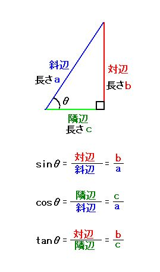
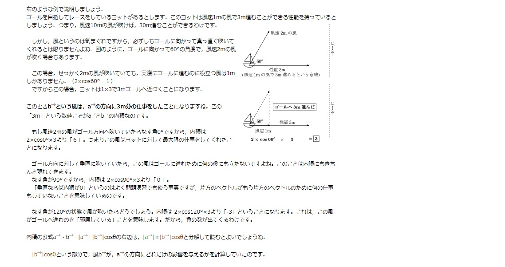

# 角度

単位円の場合  
隣辺はθが90度に近づくほど`0`に、  
対辺はθが90度に近づくほど`1`に

---

## 斜めベクトルの取り方

(0,0)から(1,1)に進行する場合、実際には√2移動してしまう。この場合どうするか  
半径をrとすると、隣辺は`r * cosθ`、対辺は`r * sinθ`と表すことができるので、  
`(cosθ,sinθ)`とあらわすことができる。

---

## 逆三角関数

三角関数を結果を入力として角度を得ること。  
- 三角関数  
sin45° = 1/√2  
- 逆三角関数  
asin(1/√2) = 45°

## atanとatan2
- atan  
`tanθ = y / x`　なので、`(y / x)`の値を使用して`θ`を求める  
- atan2
`x`と`y`二つの値を使用して`θ`を求める。

※正確にはxの長さ、yの長さ

atan2はアーク系の中で唯一`360°特定できる。`  
他は二通りあったりするので特定不可。(例えばsin0°だと0度か180度か)

---

## 内積
`内積とはVbがVaの方向に、Vaと共に行った仕事の量のこと`である。

**公式**  
`内積 = Va・Vb = (Xa * Xb) + (Ya * Yb)`

また、二つのベクトルが正規化されているとき、以下の特徴を有す。  
`Va ・ Vb = cosθ`