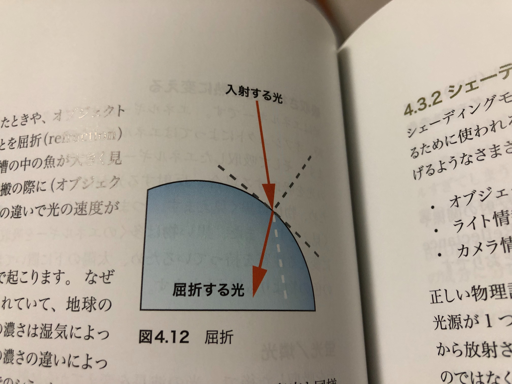
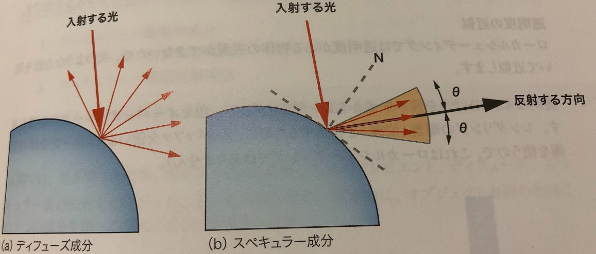

# シャドウとローカルシェーディング

- ローカルシェーディングとは  
ある点における情報のみを用いるシェーディング計算のこと。  
ある点における情報とは、その点の位置、法線、接線や入ってくるライトの強さ、方向などがあげられる

---
## ライト
- ライトの種類
    - 直接光  
    光源から発せられた光が直接オブジェクトに当たるような光を`直接光(direct light)`と呼ぶ。  
    主にディフューズ成分、スペキュラー成分の計算に使われ、以下に挙げるパラメータの違いによって  
    いくつかの種類がある。  
        - 光が発せられる位置  
        - 光が進む方向  
        - 距離による減衰  
        - 角度による減衰

  

- 平行光源(directinal light)  
    (a)のやつ。すべての光が平行に進む光源です。  
    太陽からの光は平行光源(directinal light)だとみなせますが、純粋に平行な光は現実世界には存在しません。  
    しかし、シンプルなモデルであるため、計算が軽く、扱いやすいのでCGでは広く使われる。俺も使った。  
    `光の発せられる位置は定義されていない`。スタートの位置が決まっていないので距離もはかれない。  
    そのため、`距離による光の減衰もない`。  
    また、すべて同じ方向に進み、角度のばらつきもない。  
    なにもない

 - 点光源(point light)  
    (b)のやつ。ある点から放射状に広がる光を発するのが点光源。  
    `光が発せられる点から、光の当たる点までの距離によって光の強さを減衰させることもできる`。  
    ある1点から光を発するライトは現実には存在しません。豆電球も点ではなく、領域からの光の放射。  
    こちらも平行光源同様シンプルなモデルのため、CGでは広く使われているよ。

- スポットライト(spot light)  
    (c)のやつ。点光源と同じく、ある点から放射状に広がるが、`ある限られた範囲だけに光を発する`のがスポライ。  
    点光源と同様の理由で、現実には存在しない。  

- 面光源(area light)  
    (d)のやつ。`ある広がりをもった領域が光を発する`のが面光源面。  
    複数の点光源が固まってできているとみなすことも可能、この光源は現実に存在す。

- 関節光(indirect light)   
    光源から発せられた光が直接オブジェクトに当たらず、`いったん別のオブジェクトに当たってから  
    その反射したオブジェクトに当たるような光`を関節光という。  
    `グローバルイルミネーション`とはこの関節光を計算する方法です。反射した光を計算するため、  
    光を反射した面が光源となります。すでに紹介した4つのライトすべてにおいて計算が可能。  
    関節光として有名なのは`アンビエントライト`

---
## アンビエントライト

`周りの空間のいたるところから均等に届く光`のことを環境光、またはアンビエント光と呼ぶ。  
アンビエントライトでこの環境光の近似をすることができます。  
このライトの特徴は、すべての方向から均等に同じ量の光が入ってくることです。  
これは周囲のオブジェクトからの反射光など。さまざまな方向からの光の照射を表している。  

ビルを例に出すと、ビルなどの見た目の色に空の青い色が反映されていること。  
シェーディングポイントの位置にかかわらず、全ての方向から均等に同じ量の光が入るため、  
シェーディング結果も均一の色になる。視点を変えた場合も変わらない。  
ローカルシェーディングで使われるアンビエントライトは、この均一な色を表現するように設計されていることが多く、  
`全体的に色を加算するような均一な光を発するライト`として存在している。

---
## 実世界における現象

- 光の伝わり方  
    ある光源から発せられた光がオブジェクトに当たると、  
    `反射`されたり`吸収`されたり、`伝搬`されたりします。  
    そのオブジェクトの性質によって、反射/吸収/伝搬の割合が変わります。  
    鏡の場合、100パーセント反射になるが、黒い物だとほぼ100％吸収される。真空では100％伝搬される。  

`入ってくる光のエネルギー = 反射していく光エネ + オブジェクトに吸収される光エネ + 伝搬していく光エネ`

   

基本三つの反応(反射/吸収/伝搬)は以下のように、さらに細かく現象を分けることができる。

- 反射(refrection)  
    - 鏡面反射(mirror reflection)
    - 散乱(scattering)

- 吸収(absorption)  
    - 吸収された光を熱に変える
    - 蛍光(fluorescenece)
    - 燐光(phosphorescenece)

- 伝搬(transmission)
    - 透過(transparency)
    - 屈折(refraction)
    - サブサーフェス・スキャタリング(subsurface scattering)

一個ずつ解説していくで

---
## `反射部`

## 鏡面反射
鏡面反射という現象の特徴は2つあります。  
- 入射した光が法線(N)を中心に反射される。
- 入射角と反射角は同じ角度になる。

反射された像がぼやけずはっきりと見えます。鏡面反射は`完璧な反射`といえます。
   

---
## 散乱

完璧な反射ができるオブジェクトは実世界にはなかなかなかなか存在しません。  
`１つの方向から入射した光はいくつかの方向へ反射されます`。この現象を錯乱といいます。  
鏡面反射との違いは`反射光がある広がりを持って反射する`という点です。  
鏡面反射方向からどれくらい広く散乱されるかを角度で表します。  
ローカルシェーディングモデルでは散乱を2種類にわけています。  
それが`スペキュラー`と`ディフューズ`です。詳しくは後ほど。

   

 ---
## `吸収部`

## 吸収された光を熱に変える

光はエネルギーです。エネルギーがオブジェクトに当たったとき、オブジェクトによっては  
エネルギーを吸収するものがあります。そして`吸収したエネルギーは熱に変わります`。  
`すべての光を吸収する場合、反射する光がほとんどないことになるため、物体は黒く見えます。`  
つまり`光を反射しない物は黒く見える`。QED。  
また、黒い物は多くのエネルギーを吸収し、熱に変える性質を持っているため、  
太陽の下に置いておくと他の色のものより熱くなるよ。

  

 ---
 ## 蛍光/燐光

 光を吸収した後で、`光の波長を変えてから反射することを蛍光や燐光と呼ぶ`。  
 光の入射後、`波長の変化がすぐに行われて反射される現象`が蛍光。  
 反対に、`波長の変化の後、時間をおいて少しずつ吸収した光を発光していく現象`が燐光

 お化け屋敷とかは暗い部屋の中にある蛍光なオブジェクトをUV光で照明している。  
 UV光は可視光線ではないので入射してくる光は見えないが、反射される光は見えるので、UV光を反射しているオブジェクトが発光しているように見える。  

 蛍光オブジェクトの場合、光を消してしまえば(先ほどの例の場合UV光)反射する光もなくなるが、    
 `燐光オブジェクトはすべての光を消してからでもまだ見ることができる`。  
 時計の文字盤なんかがうっすらと光るのとかそれ使ってる。  
 そういう現象をCGで表現するには`スペクタクトルモデル`が必要になる。

  

 ---
## `伝搬部`

## 透過
光がオブジェクトに当たって伝搬され、そのまままっすぐ進んでいく現象
  

---
## 屈折
伝搬された光がオブジェクトに入ったときや、オブジェクトから出た時に`進む方向が曲がること`を屈折といいます。  
たとえば水続刊で水槽の中の魚が大きく見えたりするのは屈折によるもので、伝搬の際に
空間の`濃さ`の違いで光の速度が変化し、方向が急に変わるため。

実は屈折はほとんどのオブジェクトえ起こります。なぜなら光がまっすぐ進むのは
真空に限られていて、  
地球の空気は真空ではないからです。  
空気の濃さは湿気によっても変化し、蜃気楼という現象はこの濃さの違いによっておこります。  
さすがにCGでそこまでシミュレーションはしません。空気を真空と同様に扱い、  
屈折の現象は水やグラスなどの透明なものをレンダリングする時にしか使いません。

  

---
## サブサーフェス・スキャタリング

オブジェクトの中に入り、`オブジェクトの内部で複雑な反射を繰り返してから外部に放出される`  
現象をサブサーフェス・スキャタリングという。  
入ってきた光の一部は内部で散乱を繰り返し、いくつかの別の場所で外に出ていきます。

---

# シェーディングモデルの基本

シェーディングモデルとは、`現実の世界で起こっている光の現象をコンピューター内で近似するために  使われる手法一般`のことを差します。  
このシェーディングモデルの中では以下に挙げるような様々な材料を用いて計算が行われる。  
- オブジェクト情報(法線、接線、色など)
- ライト情報(向き、色など)
- カメラ情報(位置、視線など)

正しい物理計算ではなく近似を使うのはなぜでしょう？計算が複雑だから。いじょ。

- ローカルシェーディングの表現力  

| 名前 | 可否 |
|:---:|:---:|
|鏡面反射|可能 |
|散乱|可能|
|光を熱に変える|近似が可能*1|
|蛍光・燐光|可能*2|
|透明|不可能 |
|屈折|不可能|
|サブサーフェス・スキャタリング|不可能|

- ※1  
エネルギーのシミュレーションはせず、単純に反射と伝搬の加算の結果を元の光よりも小さくさせることが可能。  
厳密に計算するには伝搬モデルとオブジェクトを全体的に考える必要あり。

- ※2  
ただし光の複雑なモデル(スペクタクトルモデル)が必要。

結局、`ローカルシェーディングで表現できるのは反射だけ`。  
吸収による現象はそれほど大きくないが、伝搬による現象を表現できないのは痛い。  
ローカルシェーディングだけでは表現力が足りないので、ローカルシェーディングにいくつかの近似を加えて  
一般的なシェーディングモデルを作る必要がある。

---

## BRDF反射モデル

ローカルシェーディングの反射モデルにおいてもっとも一般的なモデル。  
実際のオブジェクト表面は、さらに複雑な反射をすることがあります。その反射の関係や  
入射方向と反射方向の関係を式によってあらわすものがBRDF(双方向反射分布関数)  

**Lo = f(Li,θi,θo)**
  

 入射方向と反射方向を角度で表して、入射光とその角度で眼に届く光を計算してくれる式。  
 この関数は実測により求めたり、適切な計算モデルを見つけることで求められる。  
 ほとんどの反射モデルはBDFDの近似と考えられる。

 ---
 ## ローカルシェーディングに基づいた一般的なシェーディングモデル

透明なオブジェクトに対応できず、間接光を使わないモデルではかなり表現力が制限される。  
そこで、ローカルシェーディングにその近似を追加し、表現力が高いシェーディングモデルを作る必要がある。  

ローカルシェーディングに基づいたシェーディングモデルは下記の3つの部分に分かれている。
- BRDF近似の調整可能な反射モデル(ローカルシェーディングモデル)
- 間接光の近似(アンビエント成分)
- 透明度の近似(伝搬モデル)

この3つの部分を組み合わせ、いい意味での嘘を付け加えて綺麗な映像を作る。

---

## 反射モデル  
BRDFは1つの反射モデルですが、ローカルシェーディングではこの反射の現象を2つの成分にわけてモデルかされます。  
- ディフューズ/拡散反射成分  
全方向に均等な反射  
- スペキュラー/鏡面反射成分  
特定の方向だけに強く起こる反射
  

 ---

 ## 間接光の近似(アンビエント成分)
 