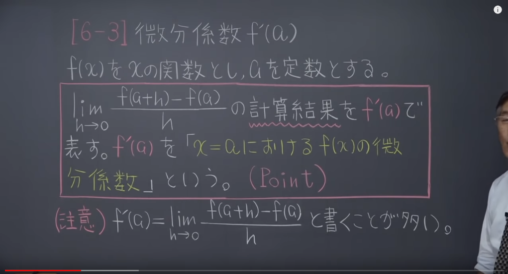
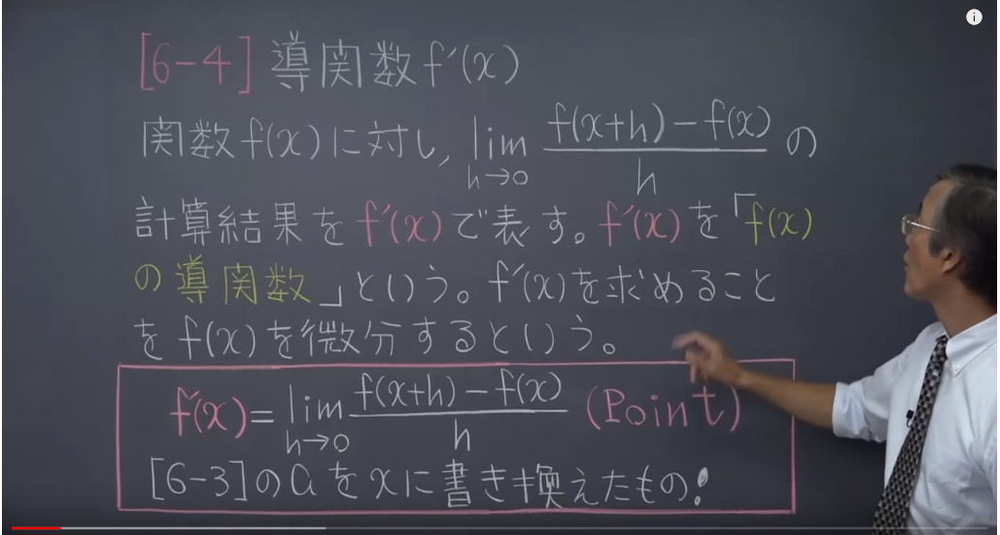

# プロシージャ

## 関数とはなんじゃい
関数では基本的に数値を入力し、計算し、出力する的な  

- 関数の入力:x
- 関数の名前:f
- 関数の出力:y  
`y = f(x)`

## 逆関数
逆関数とは、ある関数の`逆の計算をしてくれる関数`のこと。  
`出力値と入力値が反対`になった関数とお考えくださいまし  
f(a) = b  
f^(b) = a  
f(f^(b)) = b  
f^(f(a)) = a

---

## 一次関数(直線)

`l(x) = ax + b`  
`a`は傾き、`b`は切片

- 傾きと通る1点が分かる場合の直線方程式の求め方  
`y - (通y) = 傾き(x - 通x)`

---

## 導関数

***導関数f'(x)とは、y = f(x)の接線の傾きを計算する関数である。*** by ドウ・カンスウ

- 微分係数  

つまり微分係数 ＝ `f'(a)`のことよ。(f'(a)はlimの計算結果だよ簡単。)  
この微分係数のf'(a)は`y=f(a)の接線の傾きに近づいていく`

.

- 導関数  
  
つまり導関数 = `f'(x)`のこと。  
また、f'(x)を求めることを`f(x)を微分する`という。  
`f'(x)はy=f(x)の接線の傾きを計算する関数である`  

    - 基本公式  
        1. `f(x) = C` (Cの定数)の時、 `f'(x) = 0`
        2. `f(x) = x`のとき、`f'(x) = 1`
        3. `f(x) = x^n` のとき、`f'(x) = n * x^n-1`

- 接線公式  
`y - f(a) = f'(a)(x - a)`   
y - (通過y) = (傾き) * (x - (通過x)) 

## 大事なこと

- f'(x) > 0  : fが増加
- f'(x) < 0 : fが減少
- f'(x) = 0 : fが一定

|関数f(x)|導関数f'(x)|
|:-:|:-:|
|sin(x)|cons(x)|
|cos(x)|-sin(x)|
|tan(x)|1 / cos^2|
---

## MAYAパーティクル実装部

1. メニューを`Fx`に  
2. メニューリストから `nParticle`➡`エミッタの作成`
3. 作成したエミッタのアトリビュートエディタを開く
4. `nParticleShape`から`パーティクル単位(配列)のアトリビュート`を選択
5. `位置`のボタンを右クリックし、`作成時のエクスプレッション`を選択
6. 式を打ち込んで作成をクリック
7. もう一度`位置`を右クリックし、`ダイナミクス前or後のランタイム`を選択
8. 同じ式を打ち込む
9. アニメーションを再生させるとできてます。

---
## MAYA　ノード部

1. ウィンドウ > ノードエディタ
2. tabキーを押して出したいノードの名前を入力

で作れます。アウトライナに表示しない場合は、アウトライナ上で右クリック > DAGオブジェクトだけを表示のチェックを外すとよい。
